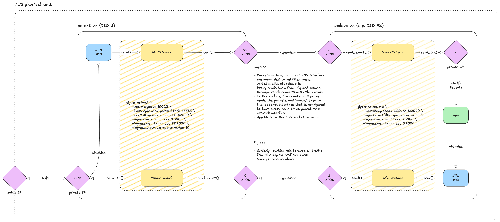

# Glycerine

Harness for networking and persistent storage in AWS Nitro Enclaves.

## Run develoment nitro enclave

0. Launch nitro-enabled VM instance in AWS.

1. Add your public ssh key into `enclave/dev/resources/root/.ssh/authorized_keys`

2. Start the enclave:

    ```bash
    make run-enclave-dev
    ```

3. Start host proxy:

    ```bash
    make run-proxy-host
    ```

4. SSH into the enclave

    ```bash
    ssh root@<host-public-ip> -p 10022
    ```

## Networking



### Host (parent VM) side

- Proxy listens on 2 vsock ports: egress proxy + bootstrap

  - Bootstrap is used to initialise enclave proxy with parameters like parent
    VM's IP address, ephemeral port range for the enclave, service ports on the
    enclave, and so on.

  - Egress proxy is used to read packets forwarded from enclave and send them to
    the network.

#### CLI

```text
Run host (parent VM) proxy

Usage: glycerine host [OPTIONS] --bootstrap-vsock-address <host-cid:port> --ingress_netfilter-queue-number <number> --ingress-vsock-address <enclave-cid:port> --egress-vsock-address <host-cid:port>

Options:
  -h, --help
          Print help (see a summary with '-h')

network:
      --interface <device>
          proxied network interface

          [env: GLYCERINE_INTERFACE=]
          [default: ens5]

      --enclave-ports <port ranges>
          ports used by enclave to accept the connections on

          must not overlap with --enclave-ephemeral-ports or --host-ephemeral-ports

          [env: GLYCERINE_ENCLAVE_PORTS=]

      --enclave-ephemeral-ports <port ranges>
          ports used by enclave to initiate the connections from

          must not overlap with --enclave-ports or --host-ephemeral-ports

          [env: GLYCERINE_ENCLAVE_EPHEMERAL_PORTS=]
          [default: 40000-60999]

      --host-ephemeral-ports <port ranges>
          ports used by host to initiate the connections from

          must not overlap with --enclave-ports or --enclave-ephemeral-ports

          [env: GLYCERINE_HOST_EPHEMERAL_PORTS=]
          [default: 32768-39999]

bootstrap:
      --bootstrap-vsock-address <host-cid:port>
          vsock address to run enclave proxy bootstrap service on

          proxy will listen on this socket and communicate bootstrap information over to
          the enclave proxy when it connects

          [env: GLYCERINE_BOOTSTRAP_VSOCK_ADDRESS=]

      --setup-only
          only configure networking (netfilter queues, rules, etc) and quit

ingress:
      --ingress_netfilter-queue-number <number>
          netfilter queue number to use for ingress

          proxy will create a netfilter queue with this number, configure netfilter rules
          to route network packets with matching ports to this queue, subscribe to it, and
          forward packets received this way to the vsock connection with an enclave

          [env: GLYCERINE_INGRESS_NETFILTER_QUEUE=]

      --ingress-vsock-address <enclave-cid:port>
          vsock address to use for ingress

          proxy will be sending packets received from netfilter queue to this socket

          [env: GLYCERINE_INGRESS_VSOCK_ADDRESS=]

egress:
      --egress-vsock-address <host-cid:port>
          vsock address to receive egress IP packets from enclave on

          proxy will listen on this socket, receive IP packets sent there by an enclave
          proxy, and "dump" them into the configured network interface

          [env: GLYCERINE_EGRESS_VSOCK_ADDRESS=]

      --egress-ipv4-sink-address <ipv4>
          egress sink ipv4 address

          this is an arbitrary IP address used with sendto() syscall; real destination IP
          addresses come from packets' headers

          [env: GLYCERINE_EGRESS_IPV4_SINK_ADDRESS=]
          [default: 1.1.1.1:1111]
```

### Enclave side

- On start, proxy connects to parent proxy's bootstrap vsock, reads the
  parameters from there and self-initialises.

- After that it begins to listen on ingress vsock port, read packets from there,
  and send them to the network interface.

#### CLI

```text
Run enclave proxy

Usage: glycerine enclave [OPTIONS] --bootstrap-vsock-address <host-cid:port> --ingress-vsock-address <enclave-cid:port> --egress_netfilter-queue-number <number> --egress-vsock-address <host-cid:port>

Options:
  -h, --help
          Print help (see a summary with '-h')

network:
      --interface <device>
          proxied network interface

          [env: GLYCERINE_INTERFACE=]
          [default: lo]

bootstrap:
      --bootstrap-vsock-address <host-cid:port>
          vsock address of the bootstrap service on host vm

          proxy will query bootstrap information from this address

          [env: GLYCERINE_BOOTSTRAP_VSOCK_ADDRESS=]

      --setup-only
          only configure networking (netfilter queues, rules, etc) and quit

ingress:
      --ingress-vsock-address <enclave-cid:port>
          vsock address to use for ingress

          proxy will listen on this socket, receive IP packets sent there by the host
          proxy, and "dump" them into the configured network interface

          [env: GLYCERINE_INGRESS_VSOCK_ADDRESS=]

egress:
      --egress_netfilter-queue-number <number>
          netfilter queue number to use for egress

          proxy will create a netfilter queue with this number, configure netfilter rules
          to route network packets to this queue, subscribe to it, and forward packets
          received this way to the vsock connection with the host vm

          [env: GLYCERINE_EGRESS_NETFILTER_QUEUE=]

      --egress-vsock-address <host-cid:port>
          vsock address to send the egress IP packets from an enclave to

          proxy will be sending packets received from netfilter queue to this socket

          [env: GLYCERINE_EGRESS_VSOCK_ADDRESS=]
```
